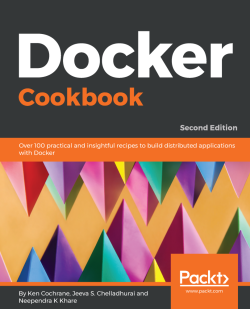

# Docker on AWS

## Intall Docker on Ubuntu 18.04

``` bash
# update apt-get libraries
sudo apt-get update

# install required packages
sudo apt-get install \
   apt-transport-https \
   ca-certificates \
   curl \
   software-properties-common

# get the GPG key for docker
curl -fsSL https://download.docker.com/linux/ubuntu/gpg | \
   sudo apt-key add -

# validating the docker GPG key is installed
sudo apt-key fingerprint 0EBFCD88

# adding the docker repository
sudo add-apt-repository \
   "deb [arch=amd64] https://download.docker.com/linux/ubuntu \
   $(lsb_release -cs) \
   stable"

# update apt-get libraries again
sudo apt-get update

# install docker
sudo apt-get install docker-ce

# validate install with version command
docker --version

# validating functionality by running a container
sudo docker run hello-world

# add the current user to the docker group
sudo usermod -aG docker $USER

# validate that sudo is no longer needed
docker run hello-world

# install docker-compose
sudo curl -L https://github.com/docker/compose/releases/download/1.21.2/docker-compose-$(uname -s)-$(uname -m) -o /usr/local/bin/docker-compose
sudo chmod +x /usr/local/bin/docker-compose
```

``` bash
   39  docker system info
   40  docker system info | grep Swarm
   41  docker swarm init
   42  docker system info | grep Swarm
   43  docker swarm --help
   44  docker swarm ca --help
   45  docker swarm ca
   46  docker swarm join-token
   47  docker swarm join-token --help
   48  docker swarm join-token -q
   49  docker swarm join-token manager
   50  docker swarm join-token worker
   51  docker swarm unlock-key
   52  docker swarm init
   56  docker service create --help
   64  docker container ls -a
   65  docker container rm -f $(docker container ls -aq)
   66  docker container ls -a
   67  docker container run --detach --name web-server003 --publish 80:80 nginx
   68  docker container ls -a
   70  docker container logs --follow --timestamps web-server003
   72  docker container top web-server003
   74  docker container inspect web-server003
   76  sudo apt  install jq
   77  docker container inspect --format '{{json .State}}' web-server003 | jq
   ```

[](https://subscription.packtpub.com/book/virtualization_and_cloud/9781788626866/3/ch03lvl1sec48/building-an-apache-image-a-dockerfile-example "https://subscription.packtpub.com/book/virtualization_and_cloud/9781788626866/3/ch03lvl1sec48/building-an-apache-image-a-dockerfile-example")

[](https://subscription.packtpub.com/book/virtualization_and_cloud/9781788626866/3/ch03lvl1sec48/building-an-apache-image-a-dockerfile-example)
