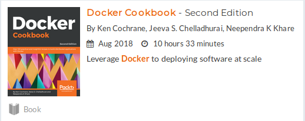
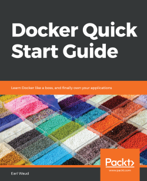
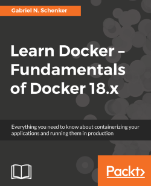
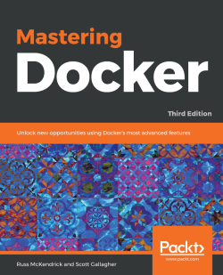

# [ChatSocketIO Draggable Dice DockerFile React AWS](http://ec2-52-87-220-90.compute-1.amazonaws.com/ "NGINX Docker AWS")

## Intall Docker on Ubuntu 18.04

``` bash
# update apt-get libraries
sudo apt-get update

# install required packages
sudo apt-get install \
   apt-transport-https \
   ca-certificates \
   curl \
   software-properties-common

# get the GPG key for docker
curl -fsSL https://download.docker.com/linux/ubuntu/gpg | \
   sudo apt-key add -

# validating the docker GPG key is installed
sudo apt-key fingerprint 0EBFCD88

# adding the docker repository
sudo add-apt-repository \
   "deb [arch=amd64] https://download.docker.com/linux/ubuntu \
   $(lsb_release -cs) \
   stable"

# update apt-get libraries again
sudo apt-get update

# install docker
sudo apt-get install docker-ce

# validate install with version command
docker --version

# validating functionality by running a container
sudo docker run hello-world

# add the current user to the docker group
sudo usermod -aG docker $USER

# validate that sudo is no longer needed
docker run hello-world

# install docker-compose
sudo curl -L https://github.com/docker/compose/releases/download/1.21.2/docker-compose-$(uname -s)-$(uname -m) -o /usr/local/bin/docker-compose
sudo chmod +x /usr/local/bin/docker-compose
```

``` bash
   39  docker system info
   40  docker system info | grep Swarm
   41  docker swarm init
   42  docker system info | grep Swarm
   43  docker swarm --help
   44  docker swarm ca --help
   45  docker swarm ca
   46  docker swarm join-token
   47  docker swarm join-token --help
   48  docker swarm join-token -q
   49  docker swarm join-token manager
   50  docker swarm join-token worker
   51  docker swarm unlock-key
   52  docker swarm init
   56  docker service create --help
   64  docker container ls -a
   65  docker container rm -f $(docker container ls -aq)
   66  docker container ls -a
   67  docker container run --detach --name web-server003 --publish 80:80 nginx
   68  docker container ls -a
   70  docker container logs --follow --timestamps web-server003
   72  docker container top web-server003
   74  docker container inspect web-server003
   76  sudo apt  install jq
   77  docker container inspect --format '{{json .State}}' web-server003 | jq
   ## 78
   79  docker container stats
   81  docker container stats
   82  docker network ls
   83  docker network prune
   84  docker network ls
   85  docker network prune
   86  docker network ls
   87  docker network inspect specifics-over --format '{{json .IPAM.Config}}' | jq
   88  docker network inspect bridge --format '{{json .IPAM.Config}}' | jq
   89  docker version
   90  docker search --limit 5 alpine
   91  docker search --help
   98  docker
   99  docker info
  100  docker search --limit 5 alpine
  101  docker network inspect bridge --format '{{json .IPAM.Config}}' | jq
  102  docker network ls
  103  docker container stats
  104  docker container inspect --format '{{json .State}}' web-server003 | jq
  105  docker container top web-server003
  106  docker container run --detach --name web-server003 --publish 80:80 nginx
  107  docker info
  108  docker container ls -a
  109  docker container nginx start
  110  docker container start nginx
  111  docker container ls -a
  112  docker container start 2abfac
  113  history
  114  clear
  115  docker system info
  116  docker system info | grep Swarm
  117  docker swarm ca
  118  docker container inspect --format '{{json .State}}' web-server003 | jq
  119  clear
  120  docker container stats
  121  docker network inspect specifics-over --format '{{json .IPAM.Config}}' | jq
  122  docker network inspect bridge --format '{{json .IPAM.Config}}' | jq
  123  docker container stats
  124  docker network inspect specifics-over --format '{{json .IPAM.Config}}' | jq
  125  docker container stats
  126  docker system info | grep Swarm
  127  docker container start 2abfac
  128  docker container ls -a
  129  docker info
  130  docker container top web-server003
  131  docker search --limit 5 alpine
  132  docker info
  133  docker
  134  docker container ls -a
  135  docker images ls -a
  136  docker images
  137  docker version
  138  docker info
  139  docker container run --detach --name web-server003 --publish 80:80 nginx
  140  docker container ls
  141  docker images ls -a
  142  docker container ls -a
  143  docker network inspect web-server003 --format '{{json .IPAM.Config}}' | jq
  144  docker container inspect --format '{{json .State}}' web-server003 | jq
  145  docker container top web-server003
  146  docker container ls
  147  docker container ps
  148  docker container ps -a
  149  docker ps
  150  docker container exec -it web-server0003 bash
  151  docker container exec -it web-server003 bash
  152  ls
  153  docker container exec -it web-server003 bash
  154  history
  155  code .
  156  sudo snap install code
  157  sudo snap install code --classic
  158  sudo apt update
  159  docker container exec -it web-server0003 bash
  160  docker container exec -it web-server003 bash
  161  docker container run --detach --name web-server003 --publish 80:80 nginx
  162  ocker container run --detach --name web-server003 --publish 80:80 -v $(pwd):/usr/share/nginx/html nginx
  163  docker container run --detach --name web-server003 --publish 80:80 -v $(pwd):/usr/share/nginx/html nginx
  164  ls
  165  cd /
  166  ls
  167  cd /usr/share/
  168  ls
  169  cd
  170  ls
  171  cd /usr/share/
  172  ls
  173  cds ..
  174  ls
  175  cd
  176  ls
  177  docker container run --detach --name web-server003 --publish 80:80 -v $(pwd):/usr/share/nginx/html nginx
  178  git status
  179  docker container run --detach --name web-server003 --publish 80:80 -v $(pwd):/usr/share/nginx/html nginx
  180  docker image build -t btrav/nginx-website .
  181  docker images
  182  docker container ls
  183  docker container run --detach --name web-server003 --publish 80:80 -v $(pwd):/usr/share/nginx/html nginx
  192  sudo rm -r ChatSocketIO -f
  193  ls
  194  git clone git@github.com:TurtleWolf/ChatSocketIO.git
  195  git clone https://github.com/TurtleWolf/ChatSocketIO.git
docker container exec -it web-server0003 bash
docker container run --detach --name web-server003 --publish 80:80 --restart=always nginx
#  cd usr/share/nginx/html

docker container start 2abfac
docker container run --restart=always -d -i -t 2abfac /bin/bash
# docker remove all
docker container run --detach --name web-server003 --publish 80:80 -v $(pwd):/usr/share/nginx/html nginx


# docker REACT
docker container run --detach --name web-server003 --publish 80:80 -v $(pwd):/usr/share/nginx/html react

# docker DRUPAL
docker container run --detach --name web-server003 --publish 80:80 -v $(pwd):/usr/share/nginx/html drupal

# docker WORD PRESS
docker container run --detach --name web-server003 --publish 80:80 -v $(pwd):/usr/share/nginx/html wordpress

# docker DRAGGABLE DICE
docker container run --detach --name web-server003 --publish 80:80 -v $(pwd):/usr/share/nginx/html draggable dice

# docker Free Code Camp Template
docker container run --detach --name web-server003 --publish 80:80 -v $(pwd):/usr/share/nginx/html freecodecampTEMPLATE

# ChatSocketIO.git
git clone https://github.com/TurtleWolf/ChatSocketIO.git

# docker-node-mongo
git clone https://github.com/TurtleWolf/docker-node-mongo

# dockerLAMP
git clone git@github.com:TurtleWolf/dockerLAMP.git
```

[](https://subscription.packtpub.com/book/virtualization_and_cloud/9781788626866/3/ch03lvl1sec48/building-an-apache-image-a-dockerfile-example "https://subscription.packtpub.com/book/virtualization_and_cloud/9781788626866/3/ch03lvl1sec48/building-an-apache-image-a-dockerfile-example")

[](https://subscription.packtpub.com/book/virtualization_and_cloud/9781788626866/3/ch03lvl1sec48/building-an-apache-image-a-dockerfile-example)

## [Traversy Media; Exploring Docker Commands, Help & Tips](https://www.youtube.com/playlist?list=PLETG2T1KvniqIEU_xkadLpugT8nhmNxSR "Traversy Media Exploring Docker Commands, Help & Tips")

## [Traversy Media; Wordpress & Docker](https://gist.github.com/bradtraversy/faa8de544c62eef3f31de406982f1d42 "Traversy Media Wordpress & Docker")

```bash
# Show commands & management commands
docker
```

```bash
# Docker version info
docker version
```

```bash
# Show info like number of containers, etc
docker info
```

## WORKING WITH CONTAINERS

```bash
# Create & run a container in foreground
docker container run -it -p 80:80 nginx
```

```bash
# Create an run a container in background
docker container run -d -p 80:80 nginx
```

```bash
# Shorthand
docker container run -d -p 80:80 nginx
```

```bash
# Naming Containers
docker container run -d -p 80:80 --name nginx-server nginx
```

### TIP: WHAT RUN DID

- Looked for image called nginx in image cache
- If not found in cache, it looks to the default image repo on Dockerhub
- Pulled it down (latest version), stored in the image cache
- Started it in a new container
- We specified to take port 80- on the host and forward to port 80 on the container
- We could do "$ docker container run --publish 8000:80 --detach nginx" to use port 8000
- We can specify versions like "nginx:1.09"

```bash
# List running containers
docker container ls
```

OR

```bash
# List running containers
docker ps
```

```bash
# List all containers (Even if not running)
docker container ls -a
```

```bash
# Stop container
docker container stop [ID]
```

```bash
# Stop all running containers
docker stop $(docker ps -aq)
```

```bash
# Remove container (Can not remove running containers, must stop first)
docker container rm [ID]
```

```bash
# To remove a running container use force(-f)
docker container rm -f [ID]
```

```bash
# Remove multiple containers
docker container rm [ID] [ID] [ID]
```

```bash
# Remove all containers
docker rm $(docker ps -aq)
```

```bash
# Get logs (Use name or ID)
docker container logs [NAME]
```

```bash
# List processes running in container
docker container top [NAME]
```

#### TIP: ABOUT CONTAINERS

Docker containers are often compared to virtual machines but they are actually just processes running on your host os. In Windows/Mac, Docker runs in a mini-VM so to see the processes youll need to connect directly to that. On Linux however you can run "ps aux" and see the processes directly

## IMAGE COMMANDS

```bash
# List the images we have pulled
docker image ls
```

```bash
# We can also just pull down images
docker pull [IMAGE]
```

```bash
# Remove image
docker image rm [IMAGE]
```

```bash
# Remove all images
docker rmi $(docker images -a -q)
```

### TIP: ABOUT IMAGES

- Images are app bianaries and dependencies with meta data about the image data and how to run the image
- Images are no a complete OS. No kernel, kernel modules (drivers)
- Host provides the kernel, big difference between VM

```bash
# Some sample container creation
# NGINX:
docker container run -d -p 80:80 --name nginx nginx (-p 80:80 is optional as it runs on 80 by default)
```

```bash
# APACHE:
docker container run -d -p 8080:80 --name apache httpd
```

```bash
# MONGODB:
docker container run -d -p 27017:27017 --name mongo mongo
```

```bash
# MYSQL:
docker container run -d -p 3306:3306 --name mysql --env MYSQL_ROOT_PASSWORD=123456 mysql
```

```bash
# CONTAINER INFO
# View info on container
docker container inspect [NAME]
```

```bash
# Specific property (--format)
docker container inspect --format '{{ .NetworkSettings.IPAddress }}' [NAME]
```

```bash
# Performance stats (cpu, mem, network, disk, etc)
docker container stats [NAME]
```

## ACCESSING CONTAINERS

```bash
# Create new nginx container and bash into
docker container run -it --name [NAME] nginx bash
```

- i = interactive Keep STDIN open if not attached
- t = tty - Open prompt

**For Git Bash, use "winpty"**

```bash
winpty docker container run -it --name [NAME] nginx bash
```

```bash
# Run/Create Ubuntu container
docker container run -it --name ubuntu ubuntu
```

**(no bash because ubuntu uses bash by default)**

```bash
# You can also make it so when you exit the container does not stay by using the -rm flag
docker container run --rm -it --name [NAME] ubuntu
```

```bash
# Access an already created container, start with -ai
docker container start -ai ubuntu
```

```bash
# Use exec to edit config, etc
docker container exec -it mysql bash
```

```bash
# Alpine is a very small Linux distro good for docker
docker container run -it alpine sh
```

(use sh because it does not include bash)
(alpine uses apk for its package manager - can install bash if you want)

## NETWORKING

### "bridge" or "docker0" is the default network

```bash
# Get port
docker container port [NAME]
```

```bash
# List networks
docker network ls
```

```bash
# Inspect network
docker network inspect [NETWORK_NAME]
("bridge" is default)
```

```bash
# Create network
docker network create [NETWORK_NAME]
```

```bash
# Create container on network
docker container run -d --name [NAME] --network [NETWORK_NAME] nginx
```

```bash
# Connect existing container to network
docker network connect [NETWORK_NAME] [CONTAINER_NAME]
```

```bash
# Disconnect container from network
docker network disconnect [NETWORK_NAME] [CONTAINER_NAME]
```

```bash
# Detach network from container
docker network disconnect
```

## IMAGE TAGGING & PUSHING TO DOCKERHUB

```bash
# tags are labels that point ot an image ID
docker image ls
```

Youll see that each image has a tag

```bash
# Retag existing image
docker image tag nginx btraversy/nginx
```

```bash
# Upload to dockerhub
docker image push bradtraversy/nginx
```

```bash
# If denied, do
docker login
```

```bash
# Add tag to new image
docker image tag bradtraversy/nginx bradtraversy/nginx:testing
```

## DOCKERFILE PARTS

- FROM - The os used. Common is alpine, debian, ubuntu

- COPY   # Copies files from host to container
- ADD    # Copies files from host to container

- ENV    - Environment variables
- ARG    - Environment variables

- CMD          - Final command run when you launch a new container from image
- ENTRYPOINT   - Final command run when you launch a new container from image

- RUN - Run commands/shell scripts, etc
- EXPOSE - Ports to expose
- WORKDIR - Sets working directory (also could use 'RUN cd /some/path')

### Build image from dockerfile (reponame can be whatever)

```bash
# From the same directory as Dockerfile
docker image build -t [REPONAME] .
```

#### TIP: CACHE & ORDER

- If you re-run the build, it will be quick because everythging is cached.
- If you change one line and re-run, that line and everything after will not be cached
- Keep things that change the most toward the bottom of the Dockerfile

## EXTENDING DOCKERFILE

```bash
# Custom Dockerfile for html paqge with nginx
FROM nginx:latest # Extends nginx so everything included in that image is included here
WORKDIR /usr/share/nginx/html
COPY index.html index.html
```

```bash
# Build image from Dockerfile
docker image build -t nginx-website
```

```bash
# Running it
docker container run -p 80:80 --rm nginx-website
```

```bash
# Tag and push to Dockerhub
docker image tag nginx-website:latest btraversy/nginx-website:latest
```

```bash
docker image push bradtraversy/nginx-website
```

## VOLUMES

### Volume - Makes special location outside of container UFS. Used for databases

### Bind Mount -Link container path to host path

```bash
# Check volumes
docker volume ls
```

```bash
# Cleanup unused volumes
docker volume prune
```

```bash
# Pull down mysql image to test
docker pull mysql
```

```bash
# Inspect and see volume
docker image inspect mysql
```

```bash
# Run container
docker container run -d --name mysql -e MYSQL_ALLOW_EMPTY_PASSWORD=True mysql
```

```bash
# Inspect and see volume in container
docker container inspect mysql
```

### TIP: Mounts

- You will also see the volume under mounts
- Container gets its own uniqe location on the host to store that data
- Source: xxx is where it lives on the host

```bash
# Check volumes
docker volume ls
```

**There is no way to tell volumes apart for instance with 2 mysql containers, so we used named volumes**

```bash
# Named volumes (Add -v command)(the name here is mysql-db which could be anything)
docker container run -d --name mysql -e MYSQL_ALLOW_EMPTY_PASSWORD=True -v mysql-db:/var/lib/mysql mysql
```

```bash
# Inspect new named volume
docker volume inspect mysql-db
```

## BIND MOUNTS

- Can not use in Dockerfile, specified at run time (uses -v as well)
- ... run -v /Users/brad/stuff:/path/container (mac/linux)
- ... run -v //c/Users/brad/stuff:/path/container (windows)

**TIP: Instead of typing out local path, for working directory use $(pwd):/path/container - On windows may not work unless you are in your users folder**

```bash
# Run and be able to edit index.html file (local dir should have the Dockerfile and the index.html)
docker container run  -p 80:80 -v $(pwd):/usr/share/nginx/html nginx
docker container run --detach --name web-server003 --publish 80:80 -v $(pwd):/usr/share/nginx/html nginx
```

```bash
# Go into the container and check
docker container exec -it nginx bash
cd /usr/share/nginx/html
ls -al
```

```bash
# You could create a file in the container and it will exist on the host as well
touch test.txt
```

## DOCKER COMPOSE

- Configure relationships between containers
- Save our docker container run settings in easy to read file
- 2 Parts: YAML File (docker.compose.yml) + CLI tool (docker-compose)

### 1. docker.compose.yml - Describes solutions for

- containers
- networks
- volumes

### 2. docker-compose CLI - used for local dev/test automation with YAML files

### Sample compose file (From Bret Fishers course)

```bash
version: '2'

# same as
# docker run -p 80:4000 -v $(pwd):/site bretfisher/jekyll-serve

services:
  jekyll:
    image: bretfisher/jekyll-serve
    volumes:
      - .:/site
    ports:
      - '80:4000'
```

```bash
# To run
docker-compose up
```

```bash
# You can run in background with
docker-compose up -d
```

```bash
# To cleanup
docker-compose down
```

### Sample compose file (From Drupal)

```bash
# Drupal with PostgreSQL
#
# Access via "http://localhost:8080"
#   (or "http://$(docker-machine ip):8080" if using docker-machine)
#
# During initial Drupal setup,
# Database type: PostgreSQL
# Database name: postgres
# Database username: postgres
# Database password: example
# ADVANCED OPTIONS; Database host: postgres

version: '3.1'

services:

  drupal:
    image: drupal:8-apache-alpine
    ports:
      - 8080:80
    volumes:
      - /var/www/html/modules
      - /var/www/html/profiles
      - /var/www/html/themes
      # this takes advantage of the feature in Docker that a new anonymous
      # volume (which is what we're creating here) will be initialized with the
      # existing content of the image at the same location
      - /var/www/html/sites
    restart: always

  postgres:
    image: postgres:10
    environment:
      POSTGRES_PASSWORD: example
    restart: always
```

README.md
package-lock.js
Dockerfile
DockerIgnore
DockerCompose.yml
DockerCompose-Production.yml

[](https://subscription.packtpub.com/book/virtualization_and_cloud/9781788626866/3/ch03lvl1sec48/building-an-apache-image-a-dockerfile-example "https://subscription.packtpub.com/book/virtualization_and_cloud/9781788626866/3/ch03lvl1sec48/building-an-apache-image-a-dockerfile-example")

[](https://subscription.packtpub.com/book/networking_and_servers/9781788997027/3/ch03lvl1sec36/exec-into-a-running-container)

[](https://subscription.packtpub.com/book/virtualization_and_cloud/9781789616606/13/ch13lvl1sec116/what-does-production-look-like)

## [How to create a docker-based LAMP stack using docker-compose on Ubuntu 18.04 Bionic Beaver Linux ](https://linuxconfig.org/how-to-create-a-docker-based-lamp-stack-using-docker-compose-on-ubuntu-18-04-bionic-beaver-linux "How to create a docker-based LAMP stack using docker-compose on Ubuntu 18.04 Bionic Beaver Linux ")
